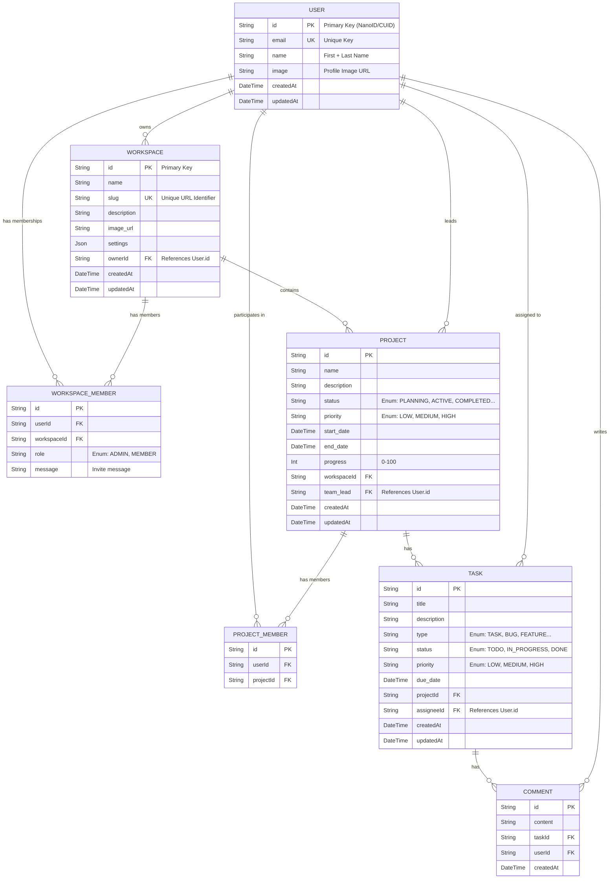

# Entity Relationship Diagram (ERD)

## Enum Definitions

### WorkspaceRole

- `ADMIN`
- `MEMBER`

### ProjectStatus

- `PLANNING`
- `ACTIVE`
- `COMPLETED`
- `ON_HOLD`
- `CANCELLED`

### ProjectPriority / TaskPriority

- `LOW`
- `MEDIUM`
- `HIGH`

### TaskStatus

- `TODO`
- `IN_PROGRESS`
- `DONE`

### TaskType

- `TASK`
- `BUG`
- `FEATURE`
- `IMPROVEMENT`
- `OTHER`
