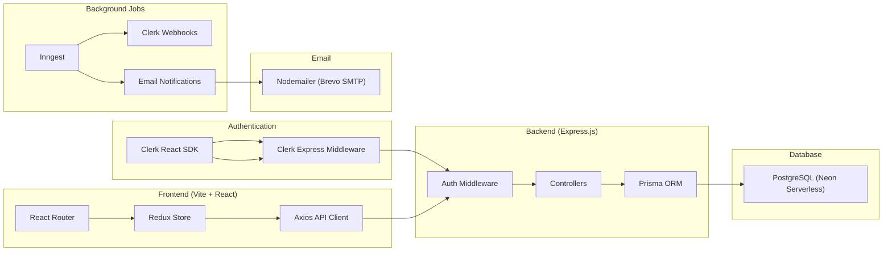

# Software Requirements Specification (SRS)

## Project Management Application

---

## 1. Introduction

### 1.1 Purpose

This document provides a comprehensive Software Requirements Specification for the **Project Management** web application — a collaborative tool for teams to organize work into Workspaces, Projects, and Tasks with real-time collaboration, automated notifications, and analytics dashboards.

### 1.2 Scope

The system enables authenticated users to create workspaces (organizations), manage projects with timelines, assign and track tasks, collaborate through task-level comments, view analytics & calendar views, and receive email notifications — all through a responsive dark/light mode UI.

### 1.3 Definitions & Abbreviations

| Term          | Definition                                                                     |
| ------------- | ------------------------------------------------------------------------------ |
| **Workspace** | An organizational container (maps to a Clerk Organization)                     |
| **Project**   | A unit of work inside a Workspace, with status, priority, dates, and team lead |
| **Task**      | An actionable item within a Project, assigned to a team member                 |
| **RBAC**      | Role-Based Access Control (ADMIN / MEMBER)                                     |
| **Inngest**   | Event-driven background function platform for webhook processing               |
| **SPA**       | Single Page Application                                                        |

---

## 2. System Overview

### 2.1 Architecture

### 2.2 Technology Stack

| Layer                  | Technology                   | Version |
| ---------------------- | ---------------------------- | ------- |
| **Frontend Framework** | React                        | 19.x    |
| **Build Tool**         | Vite                         | 7.x     |
| **Styling**            | Tailwind CSS                 | 4.x     |
| **State Management**   | Redux Toolkit                | 2.x     |
| **Routing**            | React Router DOM             | 7.x     |
| **Charts**             | Recharts                     | 3.x     |
| **Date Utilities**     | date-fns                     | 4.x     |
| **Icons**              | Lucide React                 | 0.540+  |
| **Notifications**      | React Hot Toast              | 2.x     |
| **Auth (Client)**      | @clerk/clerk-react           | 5.x     |
| **Backend**            | Express.js                   | 5.x     |
| **ORM**                | Prisma                       | 6.x     |
| **Database**           | PostgreSQL (Neon Serverless) | —       |
| **Auth (Server)**      | @clerk/express               | 1.x     |
| **Background Jobs**    | Inngest                      | 3.x     |
| **Email**              | Nodemailer (Brevo SMTP)      | 7.x     |
| **Deployment**         | Vercel (Serverless)          | —       |

### 2.3 Client-Side Routing

| Route             | Page Component   | Description                                |
| ----------------- | ---------------- | ------------------------------------------ |
| `/`               | `Layout`         | Auth guard + sidebar wrapper               |
| `/` (index)       | `Dashboard`      | Statistics, overview, activity             |
| `/team`           | `Team`           | Team member list + invite                  |
| `/projects`       | `Projects`       | Project list + search/filter               |
| `/projectsDetail` | `ProjectDetails` | Tabs: Tasks, Calendar, Analytics, Settings |
| `/taskDetails`    | `TaskDetails`    | Full task info + comment thread            |

---

## 3. User Roles & Permissions

| Action                       | Workspace ADMIN |    Workspace MEMBER    | Project Team Lead |
| ---------------------------- | :-------------: | :--------------------: | :---------------: |
| Create Workspace             | ✅ (via Clerk)  |           ❌           |         —         |
| Switch/Select Workspace      |       ✅        |           ✅           |         —         |
| Create Project               |       ✅        |           ❌           |         —         |
| Update Project               |       ✅        |           ❌           |        ✅         |
| Add Project Member           |        —        |           —            |        ✅         |
| Create Task                  |        —        |           —            |        ✅         |
| Update Task (status/details) |        —        |           —            |        ✅         |
| Delete Task(s)               |        —        |           —            |        ✅         |
| Add Comment                  |        —        | ✅ (if project member) |        ✅         |
| View Comments                |        —        | ✅ (if project member) |        ✅         |
| Invite Workspace Members     | ✅ (via Clerk)  |           ❌           |         —         |
| View Dashboard               |       ✅        |           ✅           |        ✅         |
| View Team Page               |       ✅        |           ✅           |        ✅         |
| Update Own Profile           |       ✅        |           ✅           |        ✅         |

---

## 4. Functional Requirements

### 4.1 Authentication & User Management (FR-AUTH)

| ID         | Requirement                                                                                                         |
| ---------- | ------------------------------------------------------------------------------------------------------------------- |
| FR-AUTH-01 | Users sign in/up via **Clerk** (hosted UI embedded in `Layout.jsx`)                                                 |
| FR-AUTH-02 | Unauthenticated users see the Clerk `<SignIn />` screen centered on the page                                        |
| FR-AUTH-03 | All API routes are protected by `authMiddleware.js` which validates the Clerk JWT via `req.auth`                  |
| FR-AUTH-04 | User CRUD synced from Clerk via Inngest webhooks (`clerk/user.created`, `clerk/user.updated`, `clerk/user.deleted`) |
| FR-AUTH-05 | User profile updates (first/last name) are done through Clerk's `user.update()` API on the Settings page            |
| FR-AUTH-06 | Clerk `UserButton` component displayed in the Navbar for quick profile/sign-out access                              |
| FR-AUTH-07 | Authentication tokens are passed in `Authorization: Bearer <token>` header on every API request                     |

### 4.2 Workspace Management (FR-WS)

| ID       | Requirement                                                                                                                                      |
| -------- | ------------------------------------------------------------------------------------------------------------------------------------------------ |
| FR-WS-01 | Workspaces are created via Clerk's `<CreateOrganization />` component (shown when user has no workspaces)                                        |
| FR-WS-02 | Workspace CRUD synced via Inngest (`clerk/organization.created`, `.updated`, `.deleted`)                                                         |
| FR-WS-03 | Workspace members synced via Inngest on `clerk/organizationInvitation.accepted`                                                                  |
| FR-WS-04 | Users see a list of their workspaces in a **dropdown** (`WorkspaceDropdown.jsx`) showing workspace image, name, and member count                 |
| FR-WS-05 | Current workspace is persisted in `localStorage` and restored on page reload                                                                     |
| FR-WS-06 | If user has no workspaces, they are prompted to create one via `<CreateOrganization />`                                                          |
| FR-WS-07 | `GET /api/workspaces` returns all workspaces where the user is a member, with deeply nested data (members, projects, tasks, comments, assignees) |
| FR-WS-08 | Switching workspace sets the active Clerk organization via `setActive({organization: id})` and navigates to `/`                                  |
| FR-WS-09 | Workspace dropdown closes on outside click                                                                                                       |
| FR-WS-10 | "Create Workspace" option available inside the dropdown to open Clerk's create organization modal                                                |

### 4.3 Project Management (FR-PROJ)

| ID         | Requirement                                                                                                                    |
| ---------- | ------------------------------------------------------------------------------------------------------------------------------ |
| FR-PROJ-01 | Only workspace ADMINs can create projects via `POST /api/projects`                                                             |
| FR-PROJ-02 | Project creation includes: name, description, status, priority, start/end dates, team lead (by email), team members (by email) |
| FR-PROJ-03 | Project statuses: `PLANNING`, `ACTIVE`, `COMPLETED`, `ON_HOLD`, `CANCELLED`                                                    |
| FR-PROJ-04 | Project priorities: `LOW`, `MEDIUM`, `HIGH`                                                                                    |
| FR-PROJ-05 | Projects can be updated by workspace ADMINs or the project's team lead                                                         |
| FR-PROJ-06 | Project settings tab allows editing name, description, status, priority, progress (range slider 0–100%), and start/end dates   |
| FR-PROJ-07 | New members can be added to a project by the team lead via a dropdown of non-member workspace users (`AddProjectMember.jsx`)   |
| FR-PROJ-08 | Projects page supports **search** (by name/description) and **filtering** (by status, priority)                                |
| FR-PROJ-09 | Project detail page has **4 tabs**: Tasks, Calendar, Analytics, Settings                                                       |
| FR-PROJ-10 | **Project Card** (`ProjectCard.jsx`) displays: name, description, status badge (color-coded), priority label, progress bar     |
| FR-PROJ-11 | Clicking a project card navigates to `/projectsDetail?id={id}&tab=tasks`                                                       |
| FR-PROJ-12 | Project team members are listed in settings tab, with Team Lead badge displayed                                                |
| FR-PROJ-13 | Project progress is a manually adjustable field (0–100% range slider), not auto-calculated                                     |

### 4.4 Task Management (FR-TASK)

| ID         | Requirement                                                                                                                       |
| ---------- | --------------------------------------------------------------------------------------------------------------------------------- |
| FR-TASK-01 | Only the project team lead can create tasks via `POST /api/tasks`                                                                 |
| FR-TASK-02 | Task fields: title, description, type, status, priority, assignee (must be project member), due date                              |
| FR-TASK-03 | Task types: `TASK`, `BUG`, `FEATURE`, `IMPROVEMENT`, `OTHER`                                                                      |
| FR-TASK-04 | Task statuses: `TODO`, `IN_PROGRESS`, `DONE`                                                                                      |
| FR-TASK-05 | Task priorities: `LOW`, `MEDIUM`, `HIGH`                                                                                          |
| FR-TASK-06 | Task status can be changed **inline** from the tasks table via dropdown (calls `PUT /api/tasks/:id`)                              |
| FR-TASK-07 | **Bulk task deletion**: multiple tasks can be selected via checkboxes and deleted at once (`POST /api/tasks/delete`)              |
| FR-TASK-08 | Tasks table supports **filtering** by status, type, priority, and assignee                                                        |
| FR-TASK-09 | Tasks table supports **sorting** by different columns                                                                             |
| FR-TASK-10 | On task creation, an email notification is sent to the assignee via Inngest + Nodemailer                                          |
| FR-TASK-11 | A due-date reminder email is sent automatically if task is not `DONE` by the due date (Inngest `sleep.until`)                     |
| FR-TASK-12 | Clicking a task row navigates to the Task Details page (`/taskDetails?projectId={}&taskId={}`)                                    |
| FR-TASK-13 | Tasks display in **table view** on desktop and **card view** on mobile (responsive)                                               |
| FR-TASK-14 | Each task row shows: checkbox, title, type badge (color-coded), status dropdown, priority badge, assignee avatar + name, due date |
| FR-TASK-15 | Assignee validation: task assignee must be a member of the project                                                                |

### 4.5 Comments / Task Discussion (FR-CMT)

| ID        | Requirement                                                                                                                                         |
| --------- | --------------------------------------------------------------------------------------------------------------------------------------------------- |
| FR-CMT-01 | Only project members can add comments on tasks (`POST /api/comments`). **Note**: Team Leads are automatically added as members on project creation. |
| FR-CMT-02 | Comments are displayed in a **chat-style** layout (own comments right-aligned, others left-aligned)                                                 |
| FR-CMT-03 | Comments **auto-refresh every 10 seconds** via polling (`setInterval`)                                                                              |
| FR-CMT-04 | Each comment shows author avatar, name, timestamp (relative format via `date-fns`), and content                                                     |
| FR-CMT-05 | Comments are loaded via `GET /api/comments/:taskId`                                                                                                 |

### 4.6 Dashboard (FR-DASH)

| ID         | Requirement                                                                                                                                                                                                                                                                             |
| ---------- | --------------------------------------------------------------------------------------------------------------------------------------------------------------------------------------------------------------------------------------------------------------------------------------- |
| FR-DASH-01 | **Welcome message** with user's first name                                                                                                                                                                                                                                              |
| FR-DASH-02 | **Quick action**: "Create New Project" button opens `CreateProjectDialog`                                                                                                                                                                                                               |
| FR-DASH-03 | **Stats Grid** (`StatsGrid.jsx`): 4 metric cards — Total Projects, Completed Projects, My Tasks, Overdue Tasks. Each card shows icon, value, and color-coded label                                                                                                                      |
| FR-DASH-04 | **Project Overview** (`ProjectOverview.jsx`): Displays top 5 projects with name, description, status badge, priority indicator, member count, end date, and progress bar. "View all" link navigates to `/projects`. Empty state shows folder icon + "Create your First Project" button  |
| FR-DASH-05 | **Recent Activity** (`RecentActivity.jsx`): Lists all tasks across all projects in the workspace with type-specific icons (Bug=red, Feature=blue, Task=green, Improvement=amber, Other=purple), status badge, assignee info, and formatted timestamp. Empty state shows clock icon      |
| FR-DASH-06 | **Tasks Summary** (`TasksSummary.jsx`): 3 collapsible cards — "My Tasks" (assigned to current user), "Overdue" (past due + not done), "In Progress" (status=IN_PROGRESS). Each card shows count badge + up to 3 task previews (title, type, priority). "View N more" button if >3 items |

### 4.7 Project Calendar (FR-CAL)

| ID        | Requirement                                                                                                       |
| --------- | ----------------------------------------------------------------------------------------------------------------- |
| FR-CAL-01 | **Monthly calendar grid** showing all days with task count indicators per day                                     |
| FR-CAL-02 | **Month navigation** via chevron buttons (previous/next) with `addMonths`/`subMonths` from date-fns               |
| FR-CAL-03 | **Date selection**: clicking a day highlights it and displays the tasks due on that date below the calendar       |
| FR-CAL-04 | **Overdue highlighting**: days with overdue tasks get a red border                                                |
| FR-CAL-05 | **Tasks for selected day panel**: shows task title, type badge (color-coded by type), priority, and assignee name |
| FR-CAL-06 | **Upcoming Tasks sidebar**: top 5 upcoming non-completed tasks sorted by due date                                 |
| FR-CAL-07 | **Overdue Tasks sidebar**: lists overdue tasks with red styling, shows first 5 with "+N more" indicator           |
| FR-CAL-08 | Tasks are color-coded by type: BUG=red, FEATURE=blue, TASK=green, IMPROVEMENT=purple, OTHER=amber                 |
| FR-CAL-09 | Tasks have priority-based left border: LOW=zinc, MEDIUM=amber, HIGH=orange                                        |

### 4.8 Project Analytics (FR-ANALYTICS)

| ID          | Requirement                                                                                                               |
| ----------- | ------------------------------------------------------------------------------------------------------------------------- |
| FR-ANLYT-01 | **4 metric cards**: Completion Rate (%), Active Tasks (in-progress count), Overdue Tasks, Team Size                       |
| FR-ANLYT-02 | **Bar Chart** (Recharts `BarChart`): Tasks breakdown by status (TODO, IN PROGRESS, DONE)                                  |
| FR-ANLYT-03 | **Pie Chart** (Recharts `PieChart`): Tasks breakdown by type (TASK, BUG, FEATURE, IMPROVEMENT, OTHER) with labeled slices |
| FR-ANLYT-04 | **Priority Breakdown**: Horizontal progress bars for LOW, MEDIUM, HIGH with task count and percentage                     |
| FR-ANLYT-05 | All statistics are computed client-side using `useMemo` for performance                                                   |
| FR-ANLYT-06 | Charts use a 5-color palette: blue, green, amber, red, purple                                                             |

### 4.9 Team Management (FR-TEAM)

| ID         | Requirement                                                                                                                                                                  |
| ---------- | ---------------------------------------------------------------------------------------------------------------------------------------------------------------------------- |
| FR-TEAM-01 | **Team page** displays all workspace members with their profile image, name, email, and role badge                                                                           |
| FR-TEAM-02 | **Stats header**: Total Members count, Active Projects count, Total Tasks count                                                                                              |
| FR-TEAM-03 | **Search**: Filter members by name or email in real-time                                                                                                                     |
| FR-TEAM-04 | **Invite Member dialog** (`InviteMemberDialog.jsx`): Sends an organization invitation via Clerk's `organization.inviteMember()` with email and role selection (Admin/Member) |
| FR-TEAM-05 | Invite dialog shows which workspace the invitation is for                                                                                                                    |
| FR-TEAM-06 | Each member row shows: avatar (from Clerk), name, email, workspace role badge (ADMIN/MEMBER)                                                                                 |

### 4.10 Sidebar Navigation (FR-SIDEBAR)

| ID         | Requirement                                                                                                                                                                                                                      |
| ---------- | -------------------------------------------------------------------------------------------------------------------------------------------------------------------------------------------------------------------------------- |
| FR-SIDE-01 | **Workspace Dropdown** at the top for switching workspaces                                                                                                                                                                       |
| FR-SIDE-02 | **Main Navigation Links**: Dashboard, Projects, Team (with active-state highlighting)                                                                                                                                            |
| FR-SIDE-03 | **My Tasks section** (`MyTasksSidebar.jsx`): Collapsible panel showing tasks assigned to current user with status color dots (green=DONE, yellow=IN_PROGRESS, gray=TODO). Clicking a task navigates to its details page          |
| FR-SIDE-04 | **Projects section** (`ProjectsSidebar.jsx`): Lists all projects in the workspace. Each project is expandable to show sub-navigation (Tasks, Analytics, Calendar, Settings). Active sub-item is highlighted with blue background |
| FR-SIDE-05 | **Settings link** at the bottom of the sidebar                                                                                                                                                                                   |
| FR-SIDE-06 | Sidebar is **responsive**: hidden on mobile, shown via hamburger menu toggle in Navbar                                                                                                                                           |
| FR-SIDE-07 | Sidebar closes on **outside click** on mobile                                                                                                                                                                                    |

### 4.11 Navbar (FR-NAV)

| ID        | Requirement                                                                 |
| --------- | --------------------------------------------------------------------------- |
| FR-NAV-01 | **Hamburger menu button** on mobile to toggle sidebar                       |
| FR-NAV-02 | **Search input** (currently UI-only placeholder)                            |
| FR-NAV-03 | **Theme toggle button**: switches between Sun (light) and Moon (dark) icons |
| FR-NAV-04 | **Clerk UserButton** for profile and sign-out actions                       |

### 4.12 Settings Page (FR-SET)

| ID        | Requirement                                                                                                                            |
| --------- | -------------------------------------------------------------------------------------------------------------------------------------- |
| FR-SET-01 | **Two tabs**: Profile, Account                                                                                                         |
| FR-SET-02 | **Profile tab**: Edit first name and last name, updates via Clerk `user.update()`. Shows user avatar, email (read-only), and join date |
| FR-SET-03 | **Account tab**: Sign Out button (via Clerk `signOut()` + redirect to `/`)                                                             |

### 4.13 UI/UX (FR-UI)

| ID       | Requirement                                                                                                                 |
| -------- | --------------------------------------------------------------------------------------------------------------------------- |
| FR-UI-01 | **Dark/Light theme toggle** with `localStorage` persistence via Redux `themeSlice`                                          |
| FR-UI-02 | Theme applies `dark` class to `document.documentElement` for Tailwind dark mode                                             |
| FR-UI-03 | **Responsive sidebar** with mobile hamburger menu (click-outside-to-close)                                                  |
| FR-UI-04 | All pages are responsive with **mobile card views** and **desktop table views**                                             |
| FR-UI-05 | Font: Google Fonts **"Outfit"**                                                                                             |
| FR-UI-06 | **Custom scrollbar styling** for both light and dark modes                                                                  |
| FR-UI-07 | **Dialog modals** use backdrop blur effect (`bg-black/20 backdrop-blur`)                                                    |
| FR-UI-08 | **Toast notifications** via React Hot Toast for success/error feedback                                                      |
| FR-UI-09 | **Color-coded badges** throughout the app: status badges, priority labels, type indicators all use consistent color schemes |
| FR-UI-10 | **Empty states** with icons and call-to-action buttons (e.g., "Create your First Project")                                  |
| FR-UI-11 | **Gradient buttons** using `bg-gradient-to-br from-blue-500 to-blue-600` for primary actions                                |
| FR-UI-12 | **Dark mode cards** use gradient backgrounds: `dark:bg-gradient-to-br dark:from-zinc-800/70 dark:to-zinc-900/50`            |
| FR-UI-13 | **Hover states** on all interactive elements with smooth transitions                                                        |
| FR-UI-14 | Custom checkbox styling with accent colors                                                                                  |

---

## 5. Non-Functional Requirements

| ID     | Category          | Requirement                                                                                                        |
| ------ | ----------------- | ------------------------------------------------------------------------------------------------------------------ |
| NFR-01 | **Deployment**    | Backend: Vercel Serverless Functions. Frontend: Vite SPA (likely Vercel/Netlify)                                   |
| NFR-02 | **Database**      | Neon Serverless PostgreSQL with connection pooling (PgBouncer) + direct URL for migrations                         |
| NFR-03 | **Security**      | All API routes protected by Clerk JWT. RBAC enforced at controller level                                           |
| NFR-04 | **Performance**   | Frontend state managed in Redux for instant UI updates; analytics computed via `useMemo`                           |
| NFR-05 | **Scalability**   | Serverless architecture auto-scales. Neon connection pooling handles concurrent connections                        |
| NFR-06 | **Email**         | Transactional emails via Brevo SMTP relay for task assignment + due-date reminders                                 |
| NFR-07 | **SEO**           | SPA with proper `<title>` tag ("Project Management") and viewport meta tag                                         |
| NFR-08 | **Browser**       | Modern browsers supported; uses ES modules (`"type": "module"` in package.json)                                    |
| NFR-09 | **Vercel Config** | `vercel.json` configures: src=`server.js`, Node.js 20.x, rewrites for serverless functions + Inngest webhook route |

---

## 6. API Endpoints

| Method | Endpoint                             | Controller          | Auth          | Description                                                                                                                    |
| ------ | ------------------------------------ | ------------------- | ------------- | ------------------------------------------------------------------------------------------------------------------------------ |
| `GET`  | `/api/workspaces`                    | `getUserWorkspaces` | ✅            | Get all user workspaces with deeply nested data (members → user, projects → members → user, tasks → assignee, comments → user) |
| `POST` | `/api/workspaces/sync`               | `syncWorkspaces`    | ✅            | Sync user's Clerk organizations as workspaces into DB (upserts users, workspaces, memberships)                                 |
| `POST` | `/api/projects`                      | `createProject`     | ✅ Admin      | Create project in workspace with team lead + members setup                                                                     |
| `PUT`  | `/api/projects`                      | `updateProject`     | ✅ Admin/Lead | Update project details (ID in body). Updates: name, description, status, priority, dates, progress                             |
| `POST` | `/api/projects/:projectId/addMember` | `addMember`         | ✅ Lead       | Add workspace member to project by email                                                                                       |
| `POST` | `/api/tasks`                         | `createTask`        | ✅ Lead       | Create task + send Inngest event for assignment email                                                                          |
| `PUT`  | `/api/tasks/:id`                     | `updateTask`        | ✅ Lead       | Update task fields (status, title, etc.)                                                                                       |
| `POST` | `/api/tasks/delete`                  | `deleteTask`        | ✅ Lead       | Bulk delete tasks by array of task IDs                                                                                         |
| `POST` | `/api/comments`                      | `addComment`        | ✅ Member     | Add comment to task (must be project member)                                                                                   |
| `GET`  | `/api/comments/:taskId`              | `getTaskComments`   | ✅            | Get all comments for task with user data                                                                                       |
| `GET`  | `/api/inngest`                       | Inngest serve       | —             | Inngest webhook endpoint (serves all functions)                                                                                |
| `POST` | `/api/inngest`                       | Inngest serve       | —             | Inngest webhook endpoint (receives events)                                                                                     |

---

## 7. Inngest Event-Driven Functions

| Function ID                        | Trigger Event                           | Action                                                                               |
| ---------------------------------- | --------------------------------------- | ------------------------------------------------------------------------------------ |
| `sync-user-from-clerk`             | `clerk/user.created`                    | Create user in DB with id, name, email, image                                        |
| `update-user-from-clerk`           | `clerk/user.updated`                    | Update user name, email, image in DB                                                 |
| `delete-user-with-clerk`           | `clerk/user.deleted`                    | Delete user from DB (cascades to all related data)                                   |
| `sync-workspace-from-clerk`        | `clerk/organization.created`            | Create workspace + add creator as ADMIN member                                       |
| `update-workspace-from-clerk`      | `clerk/organization.updated`            | Update workspace name, slug, image_url in DB                                         |
| `delete-workspace-with-clerk`      | `clerk/organization.deleted`            | Delete workspace from DB (cascades)                                                  |
| `sync-workspace-member-from-clerk` | `clerk/organizationInvitation.accepted` | Add invited user as MEMBER in WorkspaceMember                                        |
| `send-task-assignment-mail`        | `app/task.assigned`                     | Send assignment email + `sleep.until(due_date)` + send due-date reminder if not DONE |

---

## 8. Environment Variables

### 8.1 Client (`client/.env`)

| Variable                     | Purpose                 |
| ---------------------------- | ----------------------- |
| `VITE_CLERK_PUBLISHABLE_KEY` | Clerk frontend auth key |
| `VITE_BASEURL`               | Backend API base URL    |

### 8.2 Server (`server/.env`)

| Variable                | Purpose                                             |
| ----------------------- | --------------------------------------------------- |
| `NODE_ENV`              | Runtime environment (`development`/`production`)    |
| `CLERK_PUBLISHABLE_KEY` | Clerk publishable key                               |
| `CLERK_SECRET_KEY`      | Clerk secret key for server-side auth               |
| `DATABASE_URL`          | Neon PostgreSQL connection (pooled via PgBouncer)   |
| `DIRECT_URL`            | Neon PostgreSQL connection (direct, for migrations) |
| `INNGEST_EVENT_KEY`     | Inngest event authentication key                    |
| `INNGEST_SIGNING_KEY`   | Inngest webhook signing key                         |
| `SENDER_EMAIL`          | From address for outgoing emails                    |
| `SMTP_USER`             | Brevo SMTP relay username                           |
| `SMTP_PASS`             | Brevo SMTP relay password                           |

---

## 9. Component Map

### 9.1 Pages (6 total)

| Component        | File                       | Description                                               |
| ---------------- | -------------------------- | --------------------------------------------------------- |
| `Layout`         | `pages/Layout.jsx`         | Auth guard, sidebar wrapper, workspace fetch              |
| `Dashboard`      | `pages/Dashboard.jsx`      | Stats, project overview, activity, tasks summary          |
| `Projects`       | `pages/Projects.jsx`       | Project list with search + filters                        |
| `ProjectDetails` | `pages/ProjectDetails.jsx` | 4-tab project view (Tasks, Calendar, Analytics, Settings) |
| `TaskDetails`    | `pages/TaskDetails.jsx`    | Full task info + comment thread                           |
| `Team`           | `pages/Team.jsx`           | Team member list + invite + stats                         |
| `Settings`       | `pages/Settings.jsx`       | Profile edit + account management                         |

### 9.2 Components (18 total)

| Component             | File                      | Description                                     |
| --------------------- | ------------------------- | ----------------------------------------------- |
| `Sidebar`             | `Sidebar.jsx`             | Main navigation with workspace picker           |
| `Navbar`              | `Navbar.jsx`              | Top bar with search, theme toggle, user button  |
| `WorkspaceDropdown`   | `WorkspaceDropdown.jsx`   | Workspace switcher + create new workspace       |
| `MyTasksSidebar`      | `MyTasksSidebar.jsx`      | Collapsible list of user's assigned tasks       |
| `ProjectsSidebar`     | `ProjectsSidebar.jsx`     | Expandable project tree with sub-navigation     |
| `CreateProjectDialog` | `CreateProjectDialog.jsx` | Modal form for creating a new project           |
| `CreateTaskDialog`    | `CreateTaskDialog.jsx`    | Modal form for creating a new task              |
| `InviteMemberDialog`  | `InviteMemberDialog.jsx`  | Modal for inviting users to workspace via Clerk |
| `AddProjectMember`    | `AddProjectMember.jsx`    | Modal for adding workspace member to project    |
| `StatsGrid`           | `StatsGrid.jsx`           | 4 metric cards for dashboard                    |
| `ProjectOverview`     | `ProjectOverview.jsx`     | Top 5 projects list with progress bars          |
| `RecentActivity`      | `RecentActivity.jsx`      | Task activity feed with type-specific icons     |
| `TasksSummary`        | `TasksSummary.jsx`        | My Tasks / Overdue / In Progress cards          |
| `ProjectCard`         | `ProjectCard.jsx`         | Card component with status, priority, progress  |
| `ProjectTasks`        | `ProjectTasks.jsx`        | Task table/cards with filters + bulk actions    |
| `ProjectCalendar`     | `ProjectCalendar.jsx`     | Month view calendar with task indicators        |
| `ProjectAnalytics`    | `ProjectAnalytics.jsx`    | Charts + metrics for project analytics          |
| `ProjectSettings`     | `ProjectSettings.jsx`     | Project edit form + team member list            |

### 9.3 Redux Store

| Slice            | File                         | State Managed                                         |
| ---------------- | ---------------------------- | ----------------------------------------------------- |
| `workspaceSlice` | `features/workspaceSlice.js` | Workspaces, current workspace, projects, tasks (CRUD) |
| `themeSlice`     | `features/themeSlice.js`     | Dark/light mode toggle with localStorage persistence  |

---

## 10. Color Schemes Reference

### Status Colors

| Status    | Light Mode               | Dark Mode             |
| --------- | ------------------------ | --------------------- |
| PLANNING  | Gray bg, gray text       | Zinc bg, zinc text    |
| ACTIVE    | Emerald bg, emerald text | Emerald bg, dark text |
| ON_HOLD   | Amber bg, amber text     | Amber bg, dark text   |
| COMPLETED | Blue bg, blue text       | Blue bg, dark text    |
| CANCELLED | Red bg, red text         | Red bg, dark text     |

### Task Status Colors

| Status      | Color   |
| ----------- | ------- |
| TODO        | Gray    |
| IN_PROGRESS | Amber   |
| DONE        | Emerald |

### Task Type Colors

| Type        | Color  |
| ----------- | ------ |
| BUG         | Red    |
| FEATURE     | Blue   |
| TASK        | Green  |
| IMPROVEMENT | Purple |
| OTHER       | Amber  |

### Priority Colors

| Priority | Color |
| -------- | ----- |
| LOW      | Zinc  |
| MEDIUM   | Amber |
| HIGH     | Green |
