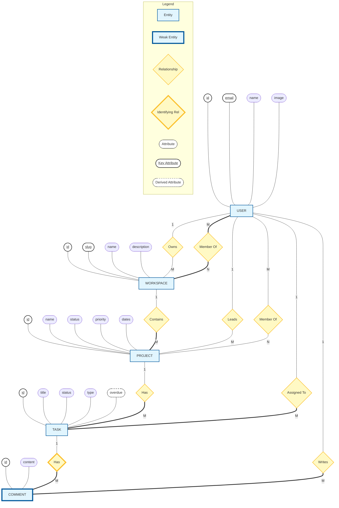

# ER Diagram (Chen Notation)

This diagram uses standard symbols:

- **Rectangles** = Entities
- **Diamonds** = Relationships
- **Ovals** = Attributes
- **Bold/Underlined Ovals** = Key Attributes
- **Thick Borders** = Weak Entities / Total Participation

